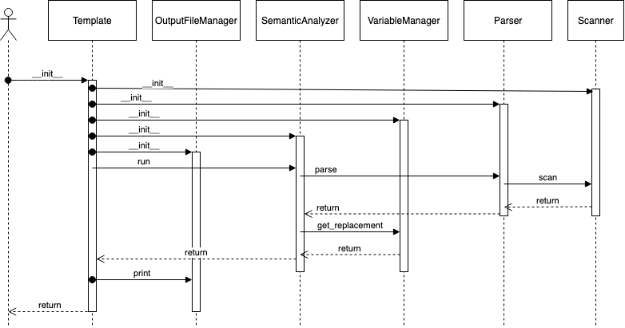
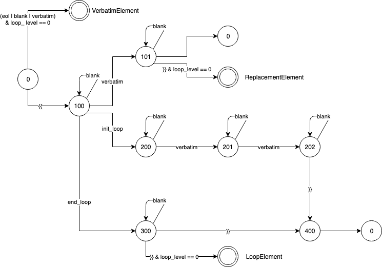

# Technical Design

## Implementation

### Sequence diagram

### Lexical analysis of the template file
The program uses a scanner for the lexical analysis of the template file obtaining the different types of tokens that
can be found in the file:
- `VERBATIM`: Any random text (ex. `hello,ajda.adas,asdsa-asdsa_`)
- `INIT_EXPRESSION` = The sequence `{{`
- `END_EXPRESSION` = The sequence `}}`
- `INIT_LOOP` = The sequence `#loop`
- `END_LOOP` = The sequence `/loop`
- `BLANK` = The blank char ` `
- `EOL` = The eol char `/n`

### Syntactical analysis of the template file
The program uses a parser for analyzing the syntax of the template file. The different syntactical elements that can be
generated are:
- `VerbatimElement`: any lexical text token such as VERBATIM, BLANK, EOL
- `ReplacementElement`: the construction for a variable replacement (ex. `{{ varname }}`)
- `LoopElement`: the construction for an iteration (ex. `{{ #loop varname iter }} repeat somethint {{ iter }}{{/loop}}`)

The Parser will raise syntactical exceptions in case ir finds some non-valid construction.

State machine implemented by the parser

### Semantic analysis of the template file
This tool will replace each syntactical element for its translation.
- `VerbatimElement` will remain unchanged
- `ReplacementElement` will be replaced for the value of the variable.
- `LoopElement`. The list of elements inside the loop will be repeated as many times as long is the value of the array
variable. In addition to that it will replace all the `ReplacementElement` inside the loop.
